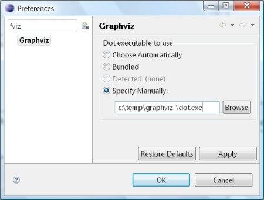
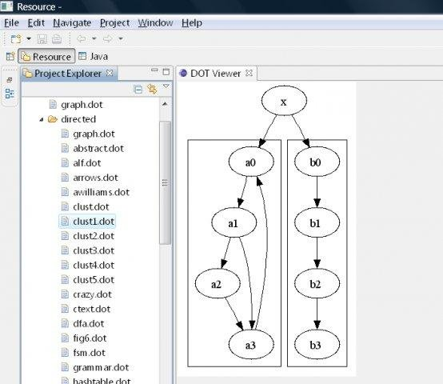
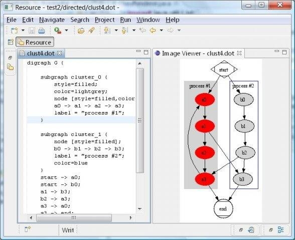

# EclipseGraphviz #

This is the home for the EclipseGraphviz project, originally on SourceForge.

[](https://textuml.ci.cloudbees.com/job/eclipse-graphviz/)

EclipseGraphviz is an Eclipse plug-in that provides a Java API for Graphviz and an Image Viewer view that allows easily visualizing the graphical output of your .dot files as you save changes to them.

# Installing EclipseGraphviz

### Requirements

-   Java 8
-   Eclipse Luna or later
-   Graphviz

### Install Eclipse

-   If you don't have Eclipse Luna or newer, install it from
    [http://eclipse.org/downloads/](http://eclipse.org/downloads/ "http://eclipse.org/downloads/")
-   Start Eclipse

#### Method 1: Installation via Eclipse Marketplace (preferred)

If you have the [Eclipse
Marketplace](http://marketplace.eclipse.org/marketplace-client-intro "http://marketplace.eclipse.org/marketplace-client-intro")
client installed, that is the easiest way to install EclipseGraphviz. Just search for the "TextUML Toolkit" (EclipseGraphviz ships as part of it), and install it directly. You can install EclipseGraphviz and skip installing the TextUML Toolkit if you prefer ([what is the TextUML Toolkit?](http://abstratt.com/textuml)). 

#### Method 2: Installation via Update Manager 
-   Open the [Software
    Updates](http://help.eclipse.org/stable/topic/org.eclipse.platform.doc.user/tasks/tasks-121.htm "http://help.eclipse.org/stable/topic/org.eclipse.platform.doc.user/tasks/tasks-121.htm")
    dialog (Help \> Install New Software...), and enter the following
    JAR URL in the "Work with:" field (include jar: to the !/ at the
    end):

<pre>jar:http://repository-textuml.forge.cloudbees.com/snapshot/com/abstratt/eclipsegraphviz/com.abstratt.eclipsegraphviz.repository/2.2.201606/com.abstratt.eclipsegraphviz.repository-2.2.201606.zip!/</pre>

-   Select the EclipseGraphviz feature from the Modeling category.

-   Accept to restart Eclipse to make the changes effective.

#### Method 3: Manual download and install from local archived repository

Some strict proxies may prevent that applications (such as Eclipse) from downloading .zip files (such as the EclipseGraphviz repository). For example, if you consistently see the Eclipse Marketplace client (method 1) or Update Manager (method 2) failing with errors like these:
```
Communication with repository at jar:http://repository-textuml.forge.cloudbees.com/snapshot/com/abstratt/eclipsegraphviz/com.abstratt.eclipsegraphviz.repository/2.2.201606/com.abstratt.eclipsegraphviz.repository-2.2.201606.zip!/content.xml.xz failed.
root cause
Caused by: java.net.SocketTimeoutException: Read timed out
```
In that case:

-    download the EclipseGraphviz repository archive from [here](http://repository-textuml.forge.cloudbees.com/snapshot/com/abstratt/eclipsegraphviz/com.abstratt.eclipsegraphviz.repository/2.2.201606/com.abstratt.eclipsegraphviz.repository-2.2.201606.zip)
-   Open the [Software
    Updates](http://help.eclipse.org/stable/topic/org.eclipse.platform.doc.user/tasks/tasks-121.htm "http://help.eclipse.org/stable/topic/org.eclipse.platform.doc.user/tasks/tasks-121.htm")
    dialog (Help \> Install New Software...), hit the Add... button, then use the "Archive..." button to find the zip file you just downloaded
-   Select the EclipseGraphviz feature from the Modeling category.
-   Accept to restart Eclipse to make the changes effective.

    
### Download and install Graphviz
If you don't have it yet, download and install
[Graphviz](http://graphviz.org/Download.php "http://graphviz.org/Download.php")
for your platform.

***Note to Windows users:** you might need to download and install the
"[Microsoft Visual C++ 2005 Redistributable Package
(x86)](http://www.microsoft.com/downloads/details.aspx?familyid=32bc1bee-a3f9-4c13-9c99-220b62a191ee&displaylang=en "http://www.microsoft.com/downloads/details.aspx?familyid=32bc1bee-a3f9-4c13-9c99-220b62a191ee&displaylang=en")"
as mentioned in the Graphviz for Windows [download
page](http://graphviz.org/Download_windows.php "http://graphviz.org/Download_windows.php").
From user reports, it seems XP usually requires that package to be
installed, while Vista does not*.

### Configure EclipseGraphviz
Once Graphviz is installed, you may need to tell EclipseGraphviz where to
find it. Open the Graphviz preference page in Eclipse and enter the
location for the dot executable.

# Using EclipseGraphviz

### How are diagrams rendered?

EclipseGraphviz provides an "Image Viewer" view that will show a
rendered diagram whenever a .dot file is selected or an editor loaded with a .dot file 
is currently selected (saving triggers updates). To open the Image Viewer, go Window
\> Show view \> Other... \> EclipseGraphviz \> Image viewer.

### Screenshots

#### Preferences page


Allows configuring how to find Graphviz and global options for the dot tool.

#### Browsing files


The Image Viewer view automatically renders diagrams as you select .dot files in Eclipse. 

#### Editing files


The Image Viewer view automatically renders diagrams as you edit .dot files in an Eclipse editor (updating as you save your changes). 
